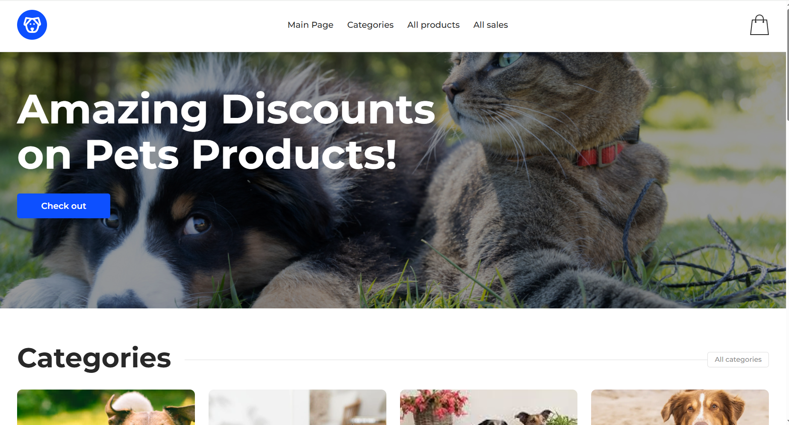

# Pet Shop

A responsive e-commerce web application for pet products built with React.

## Preview



## Live Demo

[View Live Project](https://elizaveta-tiuleneva.github.io/pet-shop/)

## Features

- Product categories
- Product catalog
- Products by category
- Sale products
- Product details
- Shopping cart
- Responsive design

## Tech Stack

- React
- JavaScript
- Vite
- React Router
- Redux Toolkit
- Axios
- CSS Modules
- REST API

## Installation

```bash
git clone https://github.com/elizaveta-tiuleneva/pet-shop.git
cd pet-shop
npm install
npm run dev
```

## Author

Elizaveta Tiuleneva